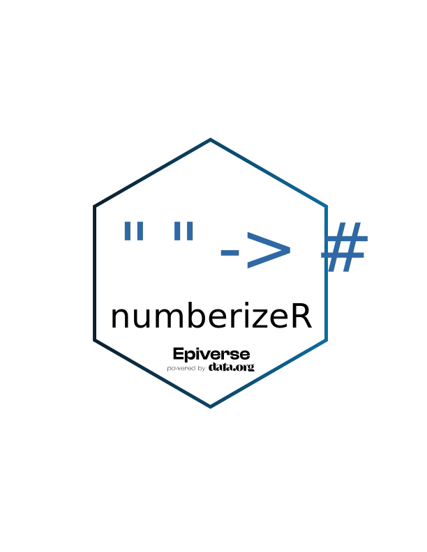

<!-- README.md is generated from README.Rmd. Please edit that file. -->
<!-- The code to render this README is stored in .github/workflows/render-readme.yaml -->
<!-- Variables marked with double curly braces will be transformed beforehand: -->
<!-- `packagename` is extracted from the DESCRIPTION file -->
<!-- `gh_repo` is extracted via a special environment variable in GitHub Actions -->

# *numberize* 

<!-- badges: start -->

[](https://opensource.org/license/mit/)
[](https://github.com/epiverse-trace/numberize/actions/workflows/R-CMD-check.yaml)
[](https://app.codecov.io/gh/epiverse-trace/numberize?branch=main)
[](https://www.reconverse.org/lifecycle.html#experimental)
[](https://CRAN.R-project.org/package=numberize)

<!-- badges: end -->

*numberize* is an R package to convert numbers written as English,
French or Spanish words from `"zero"` to
`"nine hundred and ninety nine trillion, nine hundred and ninety nine billion, nine hundred and ninety nine million, nine hundred and ninety nine thousand, nine hundred and ninety nine"`
from a character string to a numeric value.

<!-- This sentence is optional and can be removed -->

*numberize* is developed at the [Centre for the Mathematical Modelling
of Infectious
Diseases](https://www.lshtm.ac.uk/research/centres/centre-mathematical-modelling-infectious-diseases)
at the London School of Hygiene and Tropical Medicine as part of the
[Epiverse-TRACE program](https://data.org/initiatives/epiverse/).

## Installation

You can install the development version of *numberize* from
[GitHub](https://github.com/) with:

``` r
pak::pak("epiverse-trace/numberize")
```

``` r
library("numberize")
```

## Example

These examples illustrate the current functionality.

``` r
# numberize a French string
numberize("zéro", lang = "fr")
#> [1] 0

# numberize a Spanish string
numberize("Siete mil quinientos cuarenta y cinco", lang = "es")
#> [1] 7545

# numberize the English string "nine hundred and ninety-nine trillion, nine hundred and ninety-nine billion, nine hundred and ninety-nine million, nine hundred and ninety-nine thousand, nine hundred and ninety-nine" # nolint: line_length_linter.
formatC(numberize("nine hundred and ninety-nine trillion, nine hundred and ninety-nine billion, nine hundred and ninety-nine million, nine hundred and ninety-nine thousand, nine hundred and ninety-nine"), big.mark = ",", format = "fg") # nolint: line_length_linter.
#> [1] "999,999,999,999,999"

# some edge cases
numberize("veintiún", lang = "es")
#> [1] 21
numberize("veintiuno", lang = "es")
#> [1] 21

# convert a vector of written values
numberize(
  text = c(17, "dix", "soixante-cinq", "deux mille vingt-quatre", NA),
  lang = "fr"
)
#> [1]   17   10   65 2024   NA
```

## Related packages and Limitations

- [`{numberwang}`](https://github.com/coolbutuseless/numberwang)
  converts numbers to words and vice versa. Limitation: English only,
  not on CRAN.
- [`{nombre}`](https://cran.r-project.org/web/packages/nombre/index.html)
  converts numerics into words. Limitation: English only, no word to
  number conversion.
- [`{english}`](https://cran.r-project.org/web/packages/english/index.html)
  converts numerics into words. Limitation: English only, no word to
  number conversion.
- [`{spanish}`](https://cran.r-project.org/web/packages/spanish/index.html)
  converts numbers to words and vice versa. Limitation: Spanish only.

*numberize* is released as a standalone package in the hope that it will
be useful to the R community at large. *numberize* was created in
response to data cleaning requirements in
[{cleanepi}](https://github.com/epiverse-trace/cleanepi).

### Lifecycle

This package is currently experimental, as defined by the [RECON
software lifecycle](https://www.reconverse.org/lifecycle.html).

### Contributions

Contributions are welcome via [pull
requests](https://github.com/epiverse-trace/numberize/pulls).

### Code of Conduct

Please note that the *numberize* project is released with a [Contributor
Code of
Conduct](https://github.com/epiverse-trace/.github/blob/main/CODE_OF_CONDUCT.md).
By contributing to this project, you agree to abide by its terms.
